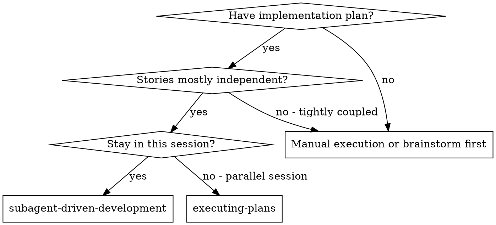
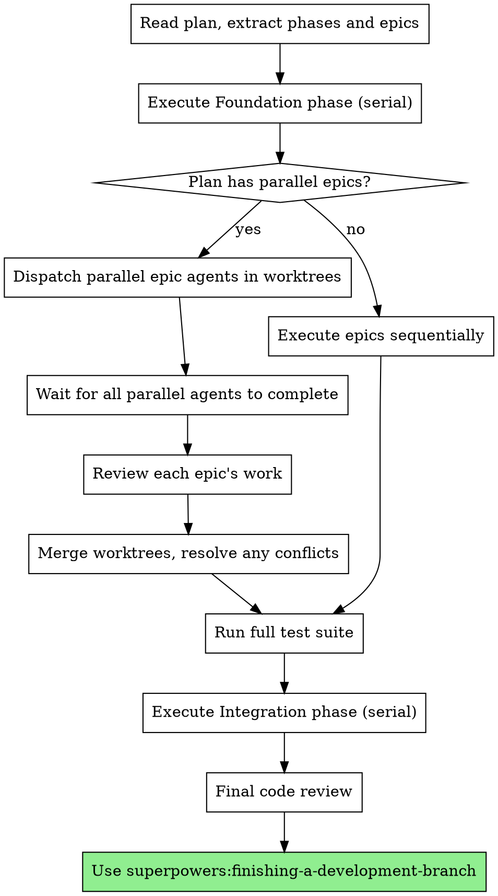
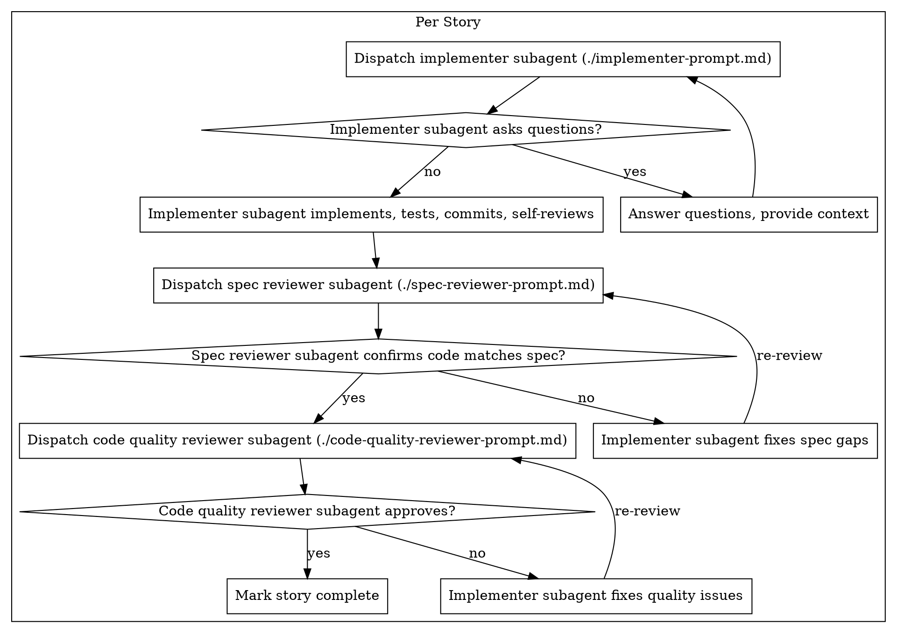

# Subagent-Driven Development

Execute plan by dispatching fresh subagent per story, with two-stage review after each: spec compliance review first, then code quality review. When the plan identifies parallel epics, dispatch epic-level agents in isolated worktrees concurrently.

**Why subagents:** You delegate tasks to specialized agents with isolated context. By precisely crafting their instructions and context, you ensure they stay focused and succeed at their task. They should never inherit your session's context or history — you construct exactly what they need. This also preserves your own context for coordination work.

**Core principle:** Fresh subagent per story + two-stage review (spec then quality) = high quality, fast iteration. Parallel epics in worktrees when the plan supports it.

## When to Use



**vs. Executing Plans (parallel session):**
- Same session (no context switch)
- Fresh subagent per story (no context pollution)
- Two-stage review after each story: spec compliance first, then code quality
- Faster iteration (no human-in-loop between stories)

## The Process

### Phase-Aware Execution

If the plan defines phases (foundation → parallel → integration), follow them:



### Within an Epic (Serial Story Execution)

Stories within an epic execute sequentially — they share files and may depend on each other.



## Parallel Epic Execution

When the plan identifies parallel epics with zero file overlap, dispatch them concurrently in isolated worktrees.

### Prerequisites

Parallel dispatch requires:
1. The plan explicitly marks epics as parallel (phase diagram)
2. File ownership declarations show zero overlap between parallel epics
3. Foundation phase is complete (shared types, config, schema all committed)

### How It Works

1. **Foundation phase completes** — shared code committed to the initiative branch (`feat/<initiative-name>`)
2. **Create one worktree per parallel epic** — each on its own branch from the initiative branch tip. **Branch naming:** use `feat/<initiative>--epic-<name>` (double-dash separator), NOT `feat/<initiative>/epic-<name>` — git cannot create `feat/x/y` if `feat/x` already exists as a branch ref.
3. **Dispatch one epic-level agent per worktree** — each agent executes its stories sequentially (same story-level process: implement → spec review → quality review). Stories commit directly to the epic branch. The worktree branch already contains all foundation code (it forked from the initiative branch tip) — agents must NOT cherry-pick or duplicate foundation commits.
4. **Wait for all agents to complete** — do not proceed until all are done
5. **Review each epic's work** — read summaries, verify file ownership was respected
6. **PR each epic branch into the initiative branch** — epic-level review (cross-story coherence, retro included)
7. **Run full test suite** — verify everything works together after merges
8. **Proceed to integration phase** if one exists

### Worktree Environment Setup

Epic agents run in isolated worktrees that may not share the main worktree's virtual environment. The epic agent prompt must include explicit environment setup instructions:

- Tell the agent where the venv is (e.g. `/path/to/main-repo/.venv/bin/python3`) OR instruct it to create its own: `python3 -m venv .venv && .venv/bin/pip install -e ".[dev]"`
- Tell the agent exactly how to run tests (e.g. `/path/to/main-repo/.venv/bin/python3 -m pytest`)
- If the main venv isn't accessible from the worktree, the agent must install deps locally

### Epic Agent Prompt

When dispatching a parallel epic agent, provide:
- The epic's section from the plan (all stories with full code)
- The plan header (goal, architecture, tech stack)
- File ownership declaration (what it owns, what it reads)
- Explicit note: "Your branch already contains all foundation code — do NOT cherry-pick or duplicate foundation commits"
- Environment setup: how to access or create a venv, exact pytest command
- Constraint: only modify files you own
- Retrospective requirement: write story retros after each story, epic retro as final commit

### If Merge Conflicts Occur

File ownership violations mean the plan's decomposition was wrong. Do not force-resolve:
1. Identify which epic violated its file ownership
2. Revert that epic's worktree
3. Fix the plan's decomposition
4. Re-dispatch the offending epic

## Model Selection

Use the least powerful model that can handle each role to conserve cost and increase speed.

**Mechanical implementation tasks** (isolated functions, clear specs, 1-2 files): use a fast, cheap model. Most implementation tasks are mechanical when the plan is well-specified.

**Integration and judgment tasks** (multi-file coordination, pattern matching, debugging): use a standard model.

**Architecture, design, and review tasks**: use the most capable available model.

**Task complexity signals:**
- Touches 1-2 files with a complete spec → cheap model
- Touches multiple files with integration concerns → standard model
- Requires design judgment or broad codebase understanding → most capable model

## Handling Implementer Status

Implementer subagents report one of four statuses. Handle each appropriately:

**DONE:** Proceed to spec compliance review.

**DONE_WITH_CONCERNS:** The implementer completed the work but flagged doubts. Read the concerns before proceeding. If the concerns are about correctness or scope, address them before review. If they're observations (e.g., "this file is getting large"), note them and proceed to review.

**NEEDS_CONTEXT:** The implementer needs information that wasn't provided. Provide the missing context and re-dispatch.

**BLOCKED:** The implementer cannot complete the task. Assess the blocker:
1. If it's a context problem, provide more context and re-dispatch with the same model
2. If the task requires more reasoning, re-dispatch with a more capable model
3. If the task is too large, break it into smaller pieces
4. If the plan itself is wrong, escalate to the human

**Never** ignore an escalation or force the same model to retry without changes. If the implementer said it's stuck, something needs to change.

## Prompt Templates

- `./implementer-prompt.md` - Dispatch implementer subagent
- `./spec-reviewer-prompt.md` - Dispatch spec compliance reviewer subagent
- `./code-quality-reviewer-prompt.md` - Dispatch code quality reviewer subagent

## Retrospectives

Subagents must write retrospectives at every level. This is how learnings survive subagent context boundaries.

**Story retrospective:** Each implementer subagent appends a brief retro after completing a story (what worked, what didn't, surprises, spec gaps). Committed with the story. **Conditional:** required when the story deviates from the plan (unexpected issues, design changes, spec gaps found). Optional for stories that execute the plan verbatim with no surprises.

**Epic retrospective:** The epic-level agent (or coordinator for serial epics) writes an epic retro as the final commit on the epic branch. Aggregates story retros + adds epic-level observations.

**Initiative retrospective:** The coordinator writes after all epics merge. Aggregates epic retros, identifies cross-cutting patterns, and flags feedback worth encoding into skills or memory.

Format and location defined in the writing-plans skill.

## Example Workflow

```
You: I'm using Subagent-Driven Development to execute this plan.

[Read plan file: docs/superpowers/plans/feature-plan.md]
[Extract phases, epics, stories]
[Create task tracking for all stories]

--- Phase 1: Foundation (on feat/my-feature branch) ---

Story 0.1: Project scaffolding
[Dispatch implementer → implements, tests, commits to feat/my-feature]
[Spec review → approved]
[Quality review → approved]
[Implementer writes story retro, commits]
[Mark complete]

Story 0.2: Shared types and config
[Dispatch implementer → implements, tests, commits]
[Spec review → approved]
[Quality review → approved]
[Implementer writes story retro, commits]
[Mark complete]

--- Phase 2: Parallel Epics ---

[Create worktree for Epic 1: branch feat/my-feature/epic-1-outlook]
[Create worktree for Epic 2: branch feat/my-feature/epic-2-engine]

[Dispatch Epic 1 agent in worktree]
  Epic 1 agent executes:
    Story 1.1 → implement, review, retro, commit
    Story 1.2 → implement, review, retro, commit
    Story 1.3 → implement, review, retro, commit
    Epic 1 retrospective → commit

[Dispatch Epic 2 agent in worktree — same pattern]

[Both agents complete]
[Review Epic 1: 3 stories done, 14 tests, retro written]
[Review Epic 2: 3 stories done, 22 tests, retro written]

[PR epic-1-outlook → feat/my-feature — epic-level review]
[PR epic-2-engine → feat/my-feature — epic-level review]
[Run full test suite — 36 tests passing]

--- Phase 3: Integration ---

Story 3.1: Wire epics together
[Dispatch implementer → implements, tests, commits]
[Spec review → approved]
[Quality review → approved]
[Story retro, commit]
[Mark complete]

--- Final ---

[Write initiative retrospective — aggregate all epic retros]
[Dispatch final code reviewer for entire implementation]
[PR feat/my-feature → main]
[Use superpowers:finishing-a-development-branch]

Done!
```

## Advantages

**vs. Manual execution:**
- Subagents follow TDD naturally
- Fresh context per story (no confusion)
- Parallel epics in worktrees (real concurrency)
- Subagent can ask questions (before AND during work)

**vs. Executing Plans:**
- Same session (no handoff)
- Continuous progress (no waiting)
- Review checkpoints automatic

**Efficiency gains:**
- No file reading overhead (controller provides full text)
- Controller curates exactly what context is needed
- Subagent gets complete information upfront
- Questions surfaced before work begins (not after)
- Parallel epics cut wall-clock time proportionally

**Quality gates:**
- Self-review catches issues before handoff
- Two-stage review: spec compliance, then code quality
- Review loops ensure fixes actually work
- Spec compliance prevents over/under-building
- Code quality ensures implementation is well-built
- Integration test suite catches cross-epic issues

**Cost:**
- More subagent invocations (implementer + 2 reviewers per story)
- Controller does more prep work (extracting phases upfront)
- Review loops add iterations
- But catches issues early (cheaper than debugging later)

## Red Flags

**Never:**
- Start implementation on main/master branch without explicit user consent
- Skip reviews (spec compliance OR code quality)
- Proceed with unfixed issues
- Dispatch multiple implementation subagents for stories **within the same epic** (they share files)
- Dispatch parallel epic agents **without verifying zero file overlap** in the plan
- Make subagent read plan file (provide full text instead)
- Skip scene-setting context (subagent needs to understand where story fits)
- Ignore subagent questions (answer before letting them proceed)
- Accept "close enough" on spec compliance (spec reviewer found issues = not done)
- Skip review loops (reviewer found issues = implementer fixes = review again)
- Let implementer self-review replace actual review (both are needed)
- **Start code quality review before spec compliance is approved** (wrong order)
- Move to next story while either review has open issues
- Force-resolve merge conflicts from parallel epics (fix the decomposition instead)

**If subagent asks questions:**
- Answer clearly and completely
- Provide additional context if needed
- Don't rush them into implementation

**If reviewer finds issues:**
- Implementer (same subagent) fixes them
- Reviewer reviews again
- Repeat until approved
- Don't skip the re-review

**If subagent fails a story:**
- Dispatch fix subagent with specific instructions
- Don't try to fix manually (context pollution)

## Integration

**Required workflow skills:**
- **superpowers:using-git-worktrees** - REQUIRED: Set up isolated workspace before starting (and for parallel epic worktrees)
- **superpowers:writing-plans** - Creates the plan this skill executes
- **superpowers:requesting-code-review** - Code review template for reviewer subagents
- **superpowers:finishing-a-development-branch** - Complete development after all stories

**Subagents should use:**
- **superpowers:test-driven-development** - Subagents follow TDD for each story

**Alternative workflow:**
- **superpowers:executing-plans** - Use for parallel session instead of same-session execution
